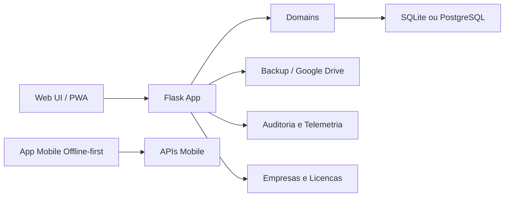
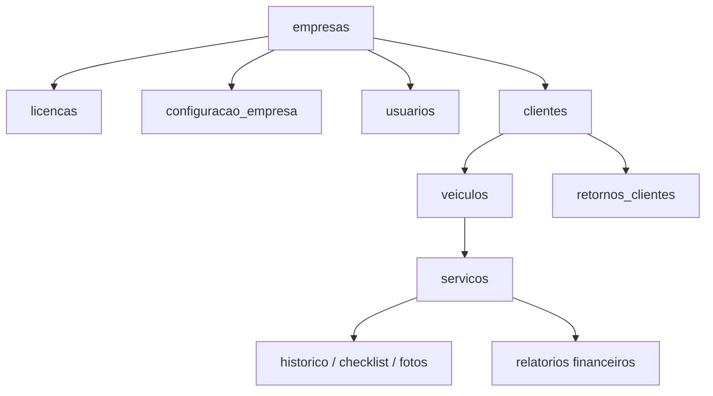

# Visao Geral Tecnica

## Produto

AutoFlow ERP e uma plataforma modular de gestao para empresas de servicos. O primeiro nicho atendido e estetica automotiva/lavagem de carros, mas a arquitetura permite adaptar o fluxo para outros segmentos que trabalham com clientes, itens atendidos, historico, status e recorrencia comercial.

## Objetivos de arquitetura

- Permitir operacao local com SQLite.
- Permitir ambiente online com PostgreSQL/Supabase.
- Preparar o sistema para multiempresa.
- Separar regras de negocio por dominio.
- Manter rastreabilidade por auditoria, telemetria e logs.
- Suportar evolucao para SaaS com licenciamento.
- Permitir uso offline-first no app mobile.

## Principais dominios

| Dominio | Arquivo | Responsabilidade |
|---|---|---|
| Clientes | `domains/clientes.py` | Cadastro, busca, veiculos e sincronizacao |
| Empresas | `domains/empresas.py` | Tenants, planos, licencas e limites |
| Financeiro | `domains/financeiro.py` | Periodos, relatorios e resumo operacional |
| Historico | `domains/historico.py` | Checklist e dependencias de servicos |
| PWA | `domains/pwa.py` | Manifesto, instalacao e contexto de app |
| Documentos fiscais | `domains/documentos_fiscais.py` | Totais de orcamento e nota fiscal |
| Produto | `core/product_foundation.py` | Migrations, multiempresa, licencas e white-label |
| Seguranca | `core/security.py` | CSRF, headers e configuracao Flask |
| Telemetria | `core/telemetry.py` | Registro de eventos tecnicos e de produto |

## Fluxo operacional

1. Usuario acessa o sistema e autentica.
2. Operador cadastra cliente e veiculo.
3. Atendimento e aberto por placa.
4. Servico passa por status operacionais.
5. Checklist, fotos e historico sao vinculados ao atendimento.
6. Finalizacao alimenta historico, financeiro e agenda de retorno.
7. Relatorios consolidam dados por periodo.

## Modelo multiempresa

O projeto usa `empresa_id` como eixo de segmentacao. As tabelas operacionais recebem o campo para permitir isolamento por empresa e evolucao para modelo SaaS.

Tabelas centrais:

- `empresas`
- `licencas`
- `configuracao_empresa`
- `usuarios`
- `clientes`
- `veiculos`
- `servicos`
- `orcamentos`
- `notas_fiscais`
- `telemetria_eventos`

## Mobile offline-first

O app em `mobile/` usa React Native, Expo e SQLite local. Ele foi pensado para registrar dados mesmo sem conexao e sincronizar pendencias quando o servidor estiver disponivel.

Componentes principais:

- banco SQLite local;
- fila `sync_queue`;
- estado de sincronizacao;
- suporte a camera;
- endpoints Flask em `/api/mobile/*`.

## Diagramas

## Seguranca e operacao

- `FLASK_SECRET_KEY` obrigatoria em ambiente real.
- CSRF configuravel.
- Cookies seguros em producao.
- Credenciais fora do repositorio.
- Backups validados antes de restauracao.
- Licencas assinadas com segredo do servidor.
- Testes automatizados para regressao e dominios.

## Evolucao recomendada

1. Migrar rotas de `app.py` para blueprints.
2. Isolar repositorios SQL por dominio.
3. Fortalecer cobertura multiempresa.
4. Consolidar sincronizacao mobile.
5. Adicionar documentacao visual com screenshots reais.
6. Preparar pipeline de deploy SaaS.
